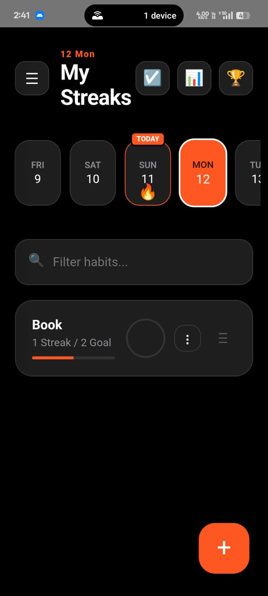
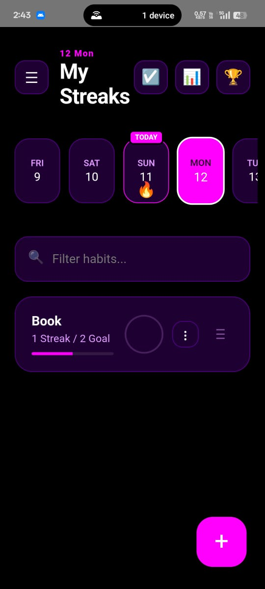

<div align="center">

  

  # StreakMaster Pro
  
  ### Build Powerful Daily Habits, Track Your Streaks & Never Break the Chain! 🔥

  <p>
    <a href="https://your-live-demo-link.com">View Live Site</a> •
    <a href="#-features">Features</a> •
    <a href="#-tech-stack">Tech Stack</a> •
    <a href="#-setup">Setup</a>
  </p>

  
  
  

</div>

---

## 🚀 About The Project

**StreakMaster Landing** is the official promotional website for the StreakMaster Pro Android App. 

Designed with a **"Dark Mode First"** philosophy, this landing page focuses on high conversion, utilizing smooth scroll animations, glowing accents, and a gamified aesthetic to encourage users to download the APK. It is lightweight, responsive, and optimized for both mobile and desktop viewing.

> *"Master Your Life One Streak at a Time."*

## 🎨 Website Features

* **✨ Scroll Reveal Animations:** Elements fade in and slide up as the user scrolls (Intersection Observer).
* **📱 Fully Responsive:** Optimized for mobile devices (where 90% of traffic comes from).
* **🎯 Smart Scrolling:** The "Get App" button smooth-scrolls exactly to the center of the viewport.
* **💎 Premium UI:** Glassmorphism headers, glowing buttons, and deep gradient backgrounds.
* **⚡ Lightweight:** Pure HTML & CSS (No heavy frameworks).

## 📱 App Features Highlighted
The landing page showcases the core functionality of the app:
* **Multi-Streak Tracking:** Manage unlimited habits simultaneously.
* **Global Leaderboards:** Gamified competition with users worldwide.
* **Privacy Mode:** Track habits without revealing identity.
* **Custom Themes:** Cyberpunk, Onyx, and Gold themes.

---

## 🛠 Tech Stack

This project is built with vanilla web technologies for maximum performance.

| Technology | Usage |
| :--- | :--- |
| **HTML5** | Semantic structure and SEO tags |
| **CSS3** | Animations, Flexbox, Grid, and Variables |
| **JavaScript** | Intersection Observers for scroll animations |
| **FontAwesome** | Icons for UI elements |
| **Google Fonts** | 'Inter' typeface for clean typography |

---

## 📸 Screenshots

<div align="center"> 
  
  
</div>

---

## ⚡ Setup & Usage

Since this is a static site, you don't need `npm` or a build process.

1.  **Clone the repository**
    ```bash
    git clone [https://github.com/yourusername/streakmaster-landing.git](https://github.com/yourusername/streakmaster-landing.git)
    ```
2.  **Navigate to the folder**
    ```bash
    cd streakmaster-landing
    ```
3.  **Open in Browser**
    Simply double-click `index.html` to view the site locally.

### Customization
To change the download link, open `index.html` and find:
```html
<a href="YOUR_MEDIAFIRE_LINK_HERE" class="cta-button" id="download-btn">
